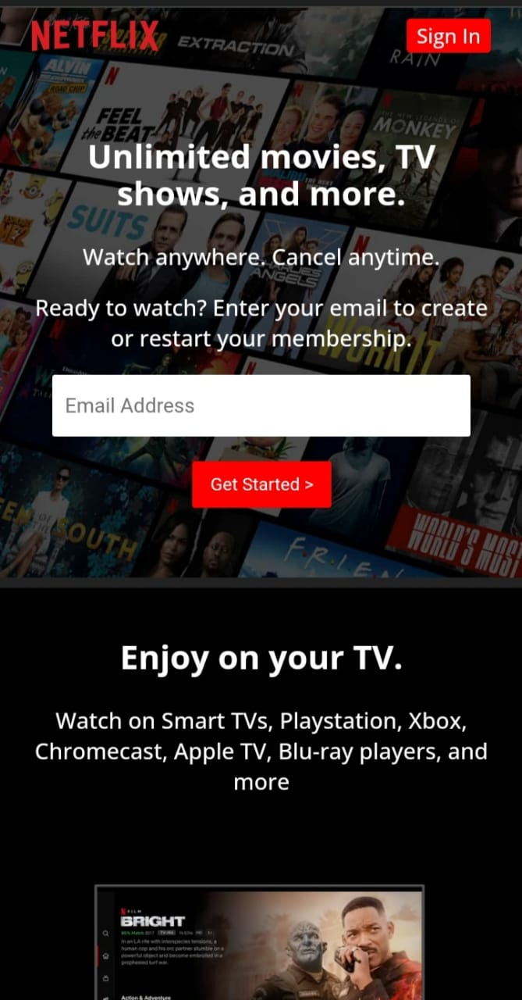

# Netflix Clone

> User Interface in Mobile responsiveness.

---

### Table of Contents

- [Description](#description)
- [How To View](#how-to-view)
- [Developer Info](#developer-info)

---

## Description

This is my Netflix user interface clone , I used raw HTML and CSS to execute it. It is also mobile responsive. It demonstrates my skills in both languages mentioned above.

#### Language(s) Used:

- HTML
- CSS

[Back To The Top](#netflix-clone)

---

## How To View

- User Interface - [Netflix Clone](https://nkah-netflix-landing-page.netlify.app/)

[Back To The Top](#netflix-clone)

---

## Developer Info

- Portfolio - [Nkanyiso's Portfolio](https://nkanyiso-portfolio.netlify.app/)

[Back To The Top](#netflix-clone)